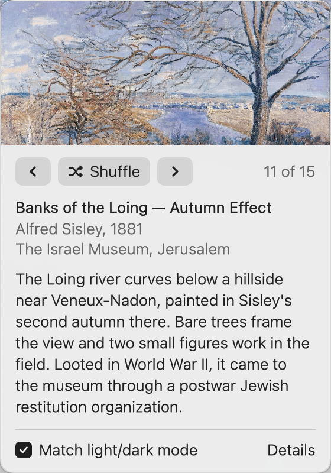

# wallbar

A macOS menu bar app and CLI for desktop wallpapers: a folder of paintings,
next / previous / shuffle, and a wall label for whatever is on the desktop.



- **Menu bar.** A thin picture-frame icon. Click it for the popover: the
  painting, previous / Shuffle / next with its place in the pool, title,
  artist, year, where it hangs, a note about it, a Match light/dark mode box and a
  link out. ←/→ step while it is open, and so does a sideways swipe over the
  picture. Scrolling over the icon steps without opening anything.
- **CLI.** The same binary with a subcommand (`wallbar next`, `wallbar list
  --json`, …). `docs/cli.md` is the contract; the Raycast extension in
  `raycast/` only talks to the CLI, and the popover picks up its changes
  within a couple of seconds.

## The folder

`~/Pictures/wallpapers` (or `$WALLBAR_DIR`): `.jpg`, `.jpeg`, `.png` and
`.heic` files named `<Light|Dark> - <Artist> - <Title>.<ext>`, sorted by name.
With Match light/dark mode on, next / previous / shuffle stay among the `Light`
files in light mode and the `Dark` files in dark mode.

Details come from an optional `paintings.json` in the folder, keyed by
filename (see `docs/cli.md`); anything missing falls back to the filename.

## Build and install

Needs Rust 1.98+ and macOS 13+.

```sh
make install   # release build -> /Applications/Wallbar.app, ~/.local/bin/wallbar, launch
make test      # unit tests (the ordering, pool and history rules live in crates/core)
make check     # fmt + clippy, warnings as errors
```

On its first run from the bundle the app registers itself as a login item
(`SMAppService`), once; turn it off in System Settings > General > Login
Items and it stays off.

Thumbnails for the popover are cached in `~/Library/Caches/wallbar`; state
(history and the Match light/dark mode switch) is in
`~/Library/Application Support/wallbar/state.json`.

## Spaces

On macOS 15, setting a wallpaper through `NSWorkspace` changes every display
but only the Space in front, once the system's wallpaper store has per-Space
entries (the first programmatic set creates them). Other Spaces keep what
they had. System Settings' "Show on all Spaces" is the only supported way to
tie them together, and a programmatic set turns it back into per-Space.

## Layout

- `crates/core` — folder listing, filename parsing, `paintings.json`, pool
  selection, next / prev / shuffle / history, and the `NSWorkspace` desktop.
- `crates/app` — the binary: `cli.rs`, the status item, the popover (gpui),
  thumbnails and the login item.

MIT licensed.
